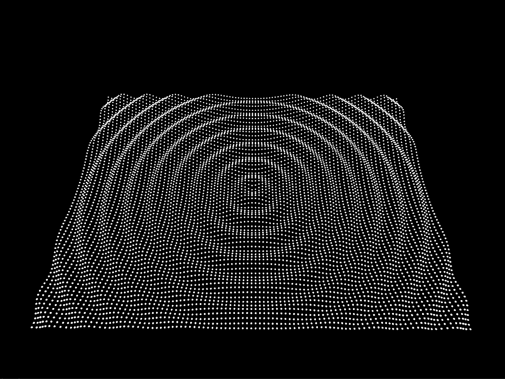

# Reto

### Vas a desarrollar una aplicación que genere una cuadrícula de esferas en un espacio tridimensional y que permita interactuar con ellas a través de la cámara y el ratón. Deberás implementar la lógica para seleccionar una esfera con el ratón y mostrar la información de la esfera seleccionada en la pantalla.

#### Para calular el valor en `z` de cada esfera usa esta función: 
```c++
float z = cos(ofDist(x, y, 0, 0) / distDiv) * amplitud;
```
Donde `distDiv` y `amplitud` son variables que puedes modificar con el teclado.

#### Al generar la cuadrícula de esferas puedes usar bucles anidados para recorrer las posiciones:
```c++
for (int x = -ofGetWidth() / 2; x < ofGetWidth() / 2; x += xStep) {
    for (int y = -ofGetHeight() / 2; y < ofGetHeight() / 2; y += yStep) {
```
Nota que `xStep` y `yStep` son variables que puedes modificar con el teclado. En la imagen que te mostré anteriormente `xStep` y `yStep` tienen el mismo valor.

#### Para seleccionar una esfera con el mouse, puedes usar los siguientes métodos:
```c++
void ofApp::mousePressed(int x, int y, int button) {
    // Convertir las coordenadas del mouse en un rayo 3D
    glm::vec3 rayStart, rayEnd;
    convertMouseToRay(x, y, rayStart, rayEnd);

    // Comprobar si el rayo intersecta alguna esfera
    sphereSelected = false;
    for (auto& pos : spherePositions) {
        glm::vec3 intersectionPoint;
        if (rayIntersectsSphere(rayStart, rayEnd - rayStart, pos, 5.0, intersectionPoint)) {
            // EN ESTA PARTE Debes adicionar la lógica para indicarle
            // a la aplicación la esfera seleccionada.
        }
    }
}
```
```c++
void ofApp::convertMouseToRay(int mouseX, int mouseY, glm::vec3& rayStart, glm::vec3& rayEnd) {
    // Obtener matrices de proyección y modelo/vista de la cámara
    glm::mat4 modelview = cam.getModelViewMatrix();
    glm::mat4 projection = cam.getProjectionMatrix();
    ofRectangle viewport = ofGetCurrentViewport();

    // Convertir coordenadas del mouse a Normalized Device Coordinates (NDC)
    float x = 2.0f * (mouseX - viewport.x) / viewport.width - 1.0f;
    float y = 1.0f - 2.0f * (mouseY - viewport.y) / viewport.height;

    // Crear el rayo en NDC
    glm::vec4 rayStartNDC(x, y, -1.0f, 1.0f); // Near plane
    glm::vec4 rayEndNDC(x, y, 1.0f, 1.0f);   // Far plane

    // Convertir a coordenadas mundiales
    glm::vec4 rayStartWorld = glm::inverse(projection * modelview) * rayStartNDC;
    glm::vec4 rayEndWorld = glm::inverse(projection * modelview) * rayEndNDC;

    rayStartWorld /= rayStartWorld.w;
    rayEndWorld /= rayEndWorld.w;

    rayStart = glm::vec3(rayStartWorld);
    rayEnd = glm::vec3(rayEndWorld);
}

// Detectar si el rayo intersecta una esfera
bool ofApp::rayIntersectsSphere(const glm::vec3& rayStart, const glm::vec3& rayDir, const glm::vec3& sphereCenter, float sphereRadius, glm::vec3& intersectionPoint) {
    glm::vec3 oc = rayStart - sphereCenter;

    float a = glm::dot(rayDir, rayDir);
    float b = 2.0f * glm::dot(oc, rayDir);
    float c = glm::dot(oc, oc) - sphereRadius * sphereRadius;

    float discriminant = b * b - 4 * a * c;

    if (discriminant < 0) {
        return false;
    }
    else {
        float t = (-b - sqrt(discriminant)) / (2.0f * a);
        intersectionPoint = rayStart + t * rayDir;
        return true;
    }
}
```
### Proceso del Reto
Uy no profe usted no se va a imaginar la triple cagada que me pasó: **DEJÉ LA MEMORIA EN EL ESTADIO JUSTO HOY**.  
En fin, resolví (me tocó repetir lo que hice hoy en clase desde cero pero equis, somos chavos). El primer avance del Reto fue lograr dibujar la malla de puntos con la primera onda por defecto de Coseno, lo que se ve así:
  
Pero, además me empezó a salir en la consola una cascada de warnings, específicamente:
```
[warning] ofMatrixStack: clearStacks(): found 1 extra modelview matrices on the stack, did you forget to pop somewhere?
[warning] ofMatrixStack: clearStacks(): found 1 extra projection matrices on the stack, did you forget to pop somewhere?
[warning] ofMatrixStack: clearStacks(): found 1 extra viewports on the stack, did you forget to popView() somewhere?
[warning] ofMatrixStack: clearStacks(): found 1 extra orientations on the stack, did you forget to popView() somewhere?
[warning] ofMatrixStack: clearStacks(): found 1 extra view matrices on the stack, did you forget to popView() somewhere?
```
Y la verdad preferí ignorar por un momento :p Pero rápidamente me di cuenta que era solo poner un `cam.end()` al final de `draw()` LOL

Ahora, un tiempo después, logré hacer un switch para detectar distintas teclas. El problema: Ahora la aplicación va a medio frame por año porque estoy intentando crear algo nuevo cada frame, incluso sin necesidad. Mi solución? Borrarr TODOS los puntos del vector que creé y rellenarlo en cada frame. Que si es una buena idea? No, pero es la que toca :p  
Usando este método pude lograr cambiar `xStep`, `yStep`, `amplitud`, `distDiv`, y hasta el color de las esferas, woooo!

Pero, hasta ahí llegué. Ya está tarde y me toca madrugar mañana, así que tristemente no pude implementar la lógica para seleccionar una esfera :c


1. **Código Fuente de la Aplicación** 
* `ofApp.h` 
```c++
#pragma once

#include "ofMain.h"

class ofApp : public ofBaseApp{

	public:
		//Variables Mías
		std::vector<ofVec3f> puntos;

		//Variables del Profe
		int xStep, yStep, distDiv, amplitud;
		bool sphereSelected;
		ofEasyCam cam;
		std::vector<glm::vec3> spherePositions;

		//Métodos Generales
		void setup();
		void update();
		void draw();

		//Métodos de Interacción (No sé cómo más llamarlos)
		void keyPressed(int key);
		void keyReleased(int key);
		void mouseMoved(int x, int y );
		void mouseDragged(int x, int y, int button);
		void mousePressed(int x, int y, int button);
		void mouseReleased(int x, int y, int button);
		void mouseEntered(int x, int y);
		void mouseExited(int x, int y);
		void windowResized(int w, int h);
		void dragEvent(ofDragInfo dragInfo);
		void gotMessage(ofMessage msg);

		//Métodos del Profe
		bool rayIntersectsSphere(const glm::vec3 & rayStart, const glm::vec3 & rayDir, const glm::vec3 & sphereCenter, float sphereRadius, glm::vec3 & intersectionPoint);
		void convertMouseToRay(int mouseX, int mouseY, glm::vec3 & rayStart, glm::vec3 & rayEnd);
};
```
* ofApp.cpp
```c++
#include "ofApp.h"

//--------------------------------------------------------------
void ofApp::setup() {
	//Inicialización de Variables
	xStep = 10;
	yStep = 10;
	distDiv = 20;
	amplitud = 20;

	//Inicialización de BG y cosas de Dibujo
	ofBackground(0);
	ofSetFrameRate(60);
	cam.setDistance(600);

	//Inicialización de Puntos o Grid
	for (int x = -ofGetWidth() / 2; x < ofGetWidth() / 2; x += xStep) {
		for (int y = -ofGetHeight() / 2; y < ofGetHeight() / 2; y += yStep) {
			float z = cos(ofDist(x, y, 0, 0) / distDiv) * amplitud;

			puntos.push_back(ofVec3f(x, y, z)); //Para llenar el vector de puntos con unas coordenadas iniciales
		}
	}
}

//--------------------------------------------------------------
void ofApp::update(){
	puntos.clear();
	for (int x = -ofGetWidth() / 2; x < ofGetWidth() / 2; x += xStep) {
		for (int y = -ofGetHeight() / 2; y < ofGetHeight() / 2; y += yStep) {
			float z = cos(ofDist(x, y, 0, 0) / distDiv) * amplitud;

			puntos.push_back(ofVec3f(x, y, z));
		}
	}
}

//--------------------------------------------------------------
void ofApp::draw(){
	cam.begin();
	ofRotateXDeg(-60); //Hace que se vea bonito :p

	for (auto& p : puntos) {
		ofDrawSphere(p, 2);
	}
	cam.end();
}

//--------------------------------------------------------------
void ofApp::keyPressed(int key){
	switch (key) {
	case 'x':
		ofLog() << "Tecla detectada: " << key;
		xStep++; //X aumenta el xStep
		break;
	case 'c':
		ofLog() << "Tecla detectada: " << key;
		xStep--; //C disminuye el xStep
		break;

	case 'y':
		ofLog() << "Tecla detectada: " << key;
		yStep++; //Y aumenta el yStep
		break;
	case 'u':
		ofLog() << "Tecla detectada: " << key;
		yStep--; //U disminuye el yStep
		break;

	case 'a':
		ofLog() << "Tecla detectada: " << key;
		amplitud += 2; //A aumenta la amplitud
		break;
	case 's':
		ofLog() << "Tecla detectada: " << key;
		amplitud -= 2; //A disminuye la amplitud
		break;

	case 'd':
		ofLog() << "Tecla detectada: " << key;
		amplitud += 2; //D aumenta el distDiv
		break;
	case 'f':
		ofLog() << "Tecla detectada: " << key;
		amplitud -= 2; //F disminuye el distDiv
		break;

	case 'r':
		ofLog() << "Tecla detectada: " << key;
		ofSetColor(ofRandom(255), ofRandom(255), ofRandom(255)); //Aplica un color aleatorio a las esferas

	default:
		//No pasa nada LOL
		break;
	}
}

//--------------------------------------------------------------
void ofApp::keyReleased(int key){

}

//--------------------------------------------------------------
void ofApp::mouseMoved(int x, int y ){

}

//--------------------------------------------------------------
void ofApp::mouseDragged(int x, int y, int button){

}

//--------------------------------------------------------------
void ofApp::mousePressed(int x, int y, int button) {
	// Convertir las coordenadas del mouse en un rayo 3D
	glm::vec3 rayStart, rayEnd;
	convertMouseToRay(x, y, rayStart, rayEnd);

	// Comprobar si el rayo intersecta alguna esfera
	sphereSelected = false;
	for (auto & pos : spherePositions) {
		glm::vec3 intersectionPoint;
		if (rayIntersectsSphere(rayStart, rayEnd - rayStart, pos, 5.0, intersectionPoint)) {
			sphereSelected = true;

			for (auto & p : puntos) {
				if (p == pos) { //Esta lógica no funciona, creo que es porque puntos y spherePositions son vectores diferentes
					ofSetColor(255, 255, 255);
					ofDrawSphere(p, 5);
				} //No me dan las tajadas a esta hora, I'm sorry :c
			}
		}
	}
}

//--------------------------------------------------------------
void ofApp::mouseReleased(int x, int y, int button){

}

//--------------------------------------------------------------
void ofApp::mouseEntered(int x, int y){

}

//--------------------------------------------------------------
void ofApp::mouseExited(int x, int y){

}

//--------------------------------------------------------------
void ofApp::windowResized(int w, int h){

}

//--------------------------------------------------------------
void ofApp::gotMessage(ofMessage msg){

}

//--------------------------------------------------------------
void ofApp::dragEvent(ofDragInfo dragInfo){ 

}

//OTROS MÉTODOS
//--------------------------------------------------------------
void ofApp::convertMouseToRay(int mouseX, int mouseY, glm::vec3 & rayStart, glm::vec3 & rayEnd) {
	// Obtener matrices de proyección y modelo/vista de la cámara
	glm::mat4 modelview = cam.getModelViewMatrix();
	glm::mat4 projection = cam.getProjectionMatrix();
	ofRectangle viewport = ofGetCurrentViewport();

	// Convertir coordenadas del mouse a Normalized Device Coordinates (NDC)
	float x = 2.0f * (mouseX - viewport.x) / viewport.width - 1.0f;
	float y = 1.0f - 2.0f * (mouseY - viewport.y) / viewport.height;

	// Crear el rayo en NDC
	glm::vec4 rayStartNDC(x, y, -1.0f, 1.0f); // Near plane
	glm::vec4 rayEndNDC(x, y, 1.0f, 1.0f); // Far plane

	// Convertir a coordenadas mundiales
	glm::vec4 rayStartWorld = glm::inverse(projection * modelview) * rayStartNDC;
	glm::vec4 rayEndWorld = glm::inverse(projection * modelview) * rayEndNDC;

	rayStartWorld /= rayStartWorld.w;
	rayEndWorld /= rayEndWorld.w;

	rayStart = glm::vec3(rayStartWorld);
	rayEnd = glm::vec3(rayEndWorld);
}

// Detectar si el rayo intersecta una esfera
bool ofApp::rayIntersectsSphere(const glm::vec3 & rayStart, const glm::vec3 & rayDir, const glm::vec3 & sphereCenter, float sphereRadius, glm::vec3 & intersectionPoint) {
	glm::vec3 oc = rayStart - sphereCenter;

	float a = glm::dot(rayDir, rayDir);
	float b = 2.0f * glm::dot(oc, rayDir);
	float c = glm::dot(oc, oc) - sphereRadius * sphereRadius;

	float discriminant = b * b - 4 * a * c;

	if (discriminant < 0) {
		return false;
	} else {
		float t = (-b - sqrt(discriminant)) / (2.0f * a);
		intersectionPoint = rayStart + t * rayDir;
		return true;
	}
}
```
2. **Informe de Manejo de Memoria**  
En este Reto, `[...]`
3. [**Demostración de Funcionamiento**](https://youtu.be/f18vqIR5IXs)